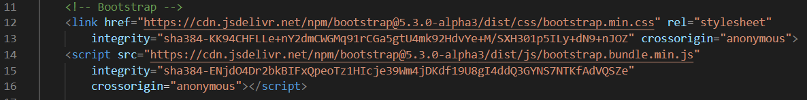
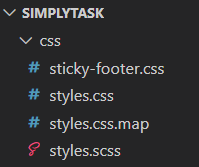
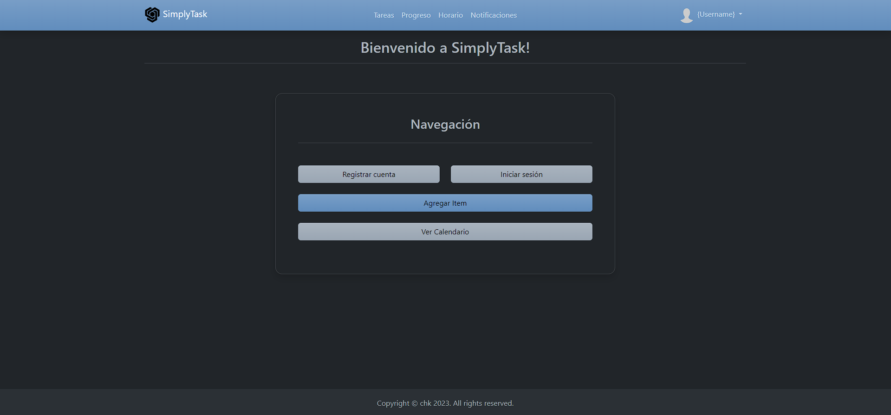
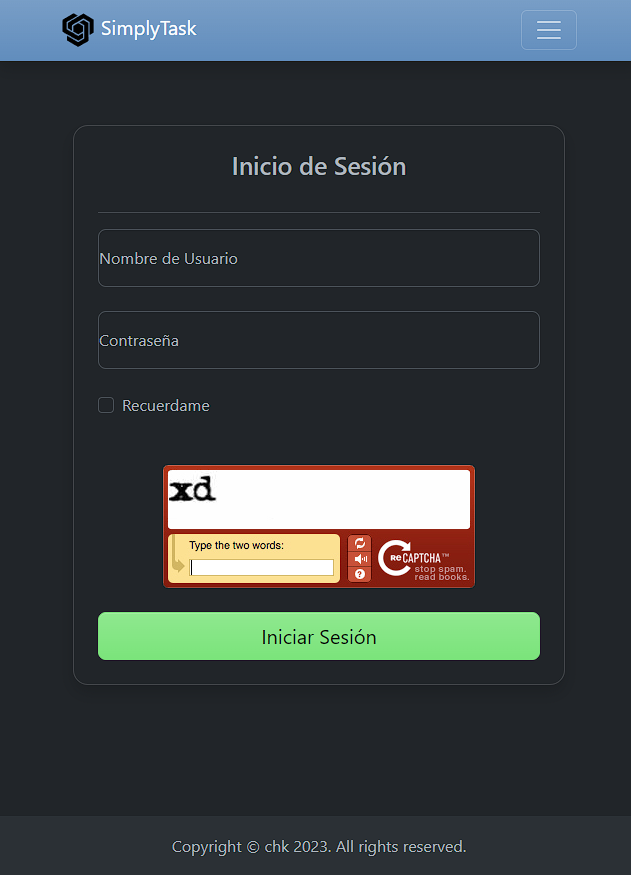
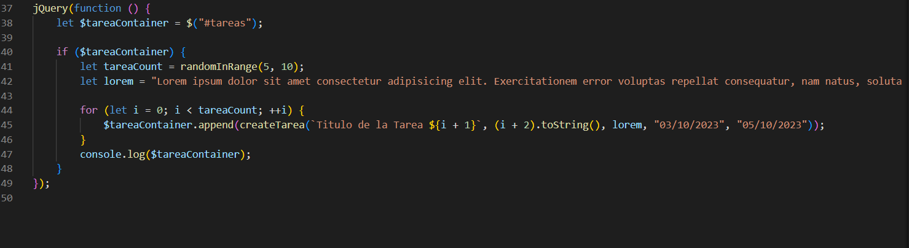
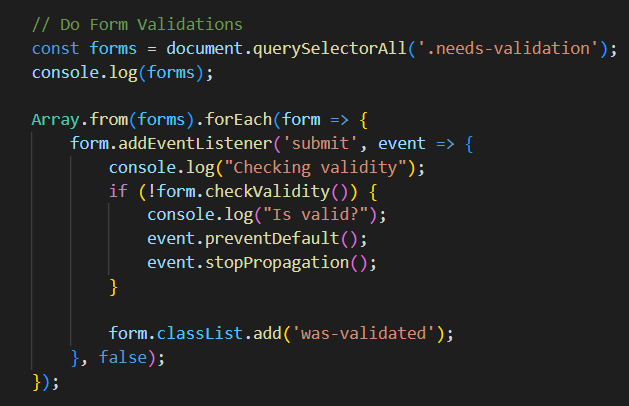
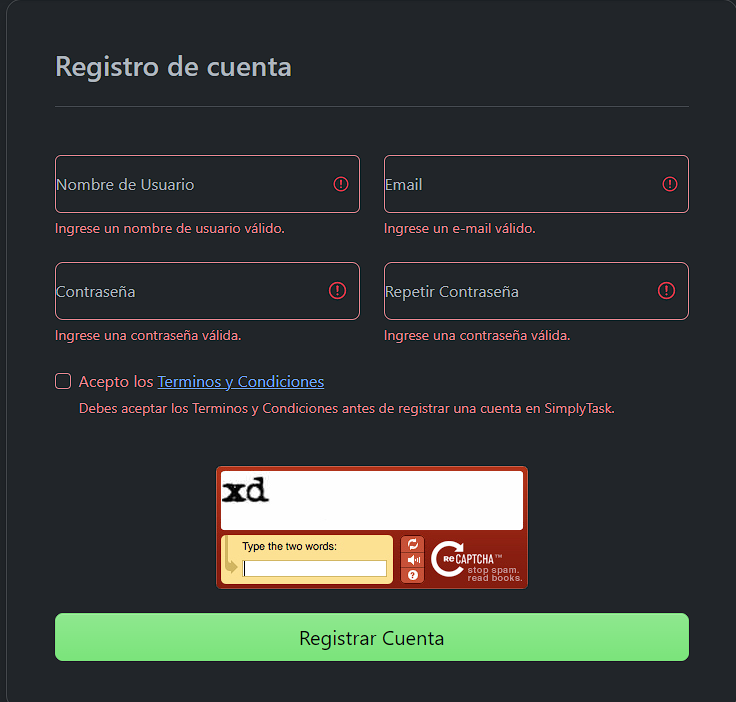
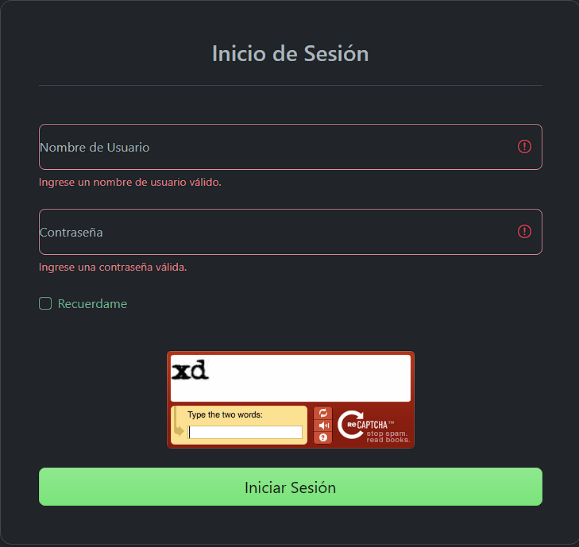

<!-- Proyecto en desarrollo, las funcionalidades pueden sufrir modificaciones en las distintas versiones -->

    Autores: Jorge Botarro Westerhout
             Jorge Ugarte Olivares

# SimplyTask!

**SimplyTask!** es un planificador de tareas, cuyo objetivo es ayudar al usuario a desarrollar su día de manera organizada, sin olvidar actividades claves o fechas importantes, mediante el uso de notificaciones y recordatorios programados para que el usuario alcance sus metas en un plazo determinado.

## EP2

* **EP2.1:Diseño responsivo usando el framework Bootstrap y manejando un preprocesador de hojas de estilo como SASS o LESS**
    * El diseño es responsivo, se utiliza tanto Bootstrap como SASS
    

    
    

     

    

    
    

     

    

    
    

     

    

    
    

     
* **EP2.2: Incluyendo interacción en el front-end haciendo uso de TS o JS usando la librería JQuery.**
    * Cumple, Se utiliza JQuery en tarea-generator.js
    

    
    

     
+ **EP2.3: Validación de los formularios haciendo uso de JS.**

    * se validan los formularios
    

    
    

     

    

    
    

     

    

    
    

     

    